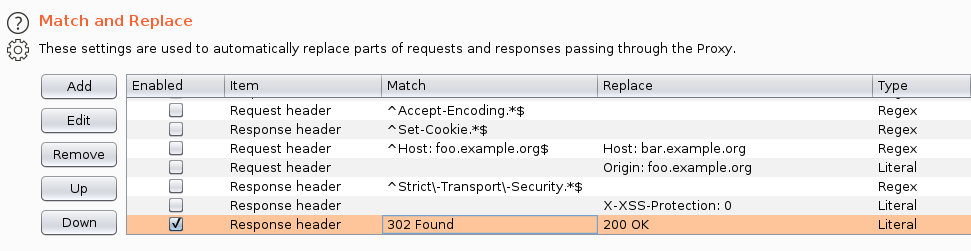

# Previse (Easy - Linux)

## Recon
### Nmap
```console
# nmap -Pn --open -sC -sV -p- 10.10.11.104
Host discovery disabled (-Pn). All addresses will be marked 'up' and scan times will be slower.
Starting Nmap 7.91 ( https://nmap.org ) at 2022-01-16 19:02 EST
Nmap scan report for 10.10.11.104
Host is up (0.037s latency).
Not shown: 65521 closed ports, 12 filtered ports
Some closed ports may be reported as filtered due to --defeat-rst-ratelimit
PORT   STATE SERVICE VERSION
22/tcp open  ssh     OpenSSH 7.6p1 Ubuntu 4ubuntu0.3 (Ubuntu Linux; protocol 2.0)
| ssh-hostkey: 
|   2048 53:ed:44:40:11:6e:8b:da:69:85:79:c0:81:f2:3a:12 (RSA)
|   256 bc:54:20:ac:17:23:bb:50:20:f4:e1:6e:62:0f:01:b5 (ECDSA)
|_  256 33:c1:89:ea:59:73:b1:78:84:38:a4:21:10:0c:91:d8 (ED25519)
80/tcp open  http    Apache httpd 2.4.29 ((Ubuntu))
| http-cookie-flags: 
|   /: 
|     PHPSESSID: 
|_      httponly flag not set
|_http-server-header: Apache/2.4.29 (Ubuntu)
| http-title: Previse Login
|_Requested resource was login.php
Service Info: OS: Linux; CPE: cpe:/o:linux:linux_kernel
```

## Initial Access
### EAR Vulnearability (Execution After Redirect)
There was a misconfiguration where an attacker could ignore the redirects and retrieve the pages which were supposed to be available on successful login.

```html
HTTP/1.1 302 Found
Date: Mon, 17 Jan 2022 00:44:13 GMT
Server: Apache/2.4.29 (Ubuntu)
Expires: Thu, 19 Nov 1981 08:52:00 GMT
Cache-Control: no-store, no-cache, must-revalidate
Pragma: no-cache
Location: login.php
Content-Length: 2801
Connection: close
Content-Type: text/html; charset=UTF-8


<!DOCTYPE html>
<html>
    <head>
        <meta http-equiv="content-type" content="text/html; charset=UTF-8" />
        <meta charset="utf-8" />
    
            
        <meta name="viewport" content="width=device-width, initial-scale=1.0" />
        <meta name="description" content="Previse rocks your socks." />
        <meta name="author" content="m4lwhere" />
        <link rel="shortcut icon" href="/favicon.ico" type="image/x-icon" />
        <link rel="icon" href="/favicon.ico" type="image/x-icon" />
        <link rel="apple-touch-icon" sizes="180x180" href="/apple-touch-icon.png">
        <link rel="icon" type="image/png" sizes="32x32" href="/favicon-32x32.png">
        <link rel="icon" type="image/png" sizes="16x16" href="/favicon-16x16.png">
        <link rel="manifest" href="/site.webmanifest">
        <link rel="stylesheet" href="css/uikit.min.css" />
        <script src="js/uikit.min.js"></script>
        <script src="js/uikit-icons.min.js"></script>
   

<title>Previse Home</title>
</head>
<body>
    
<nav class="uk-navbar-container" uk-navbar>
    <div class="uk-navbar-center">
        <ul class="uk-navbar-nav">
            <li class="uk-active"><a href="/index.php">Home</a></li>
            <li>
                <a href="accounts.php">ACCOUNTS</a>
                <div class="uk-navbar-dropdown">
                    <ul class="uk-nav uk-navbar-dropdown-nav">
                        <li><a href="accounts.php">CREATE ACCOUNT</a></li>
                    </ul>
                </div>
            </li>
            <li><a href="files.php">FILES</a></li>
            <li>
                <a href="status.php">MANAGEMENT MENU</a>
                <div class="uk-navbar-dropdown">
                    <ul class="uk-nav uk-navbar-dropdown-nav">
                        <li><a href="status.php">WEBSITE STATUS</a></li>
                        <li><a href="file_logs.php">LOG DATA</a></li>
                    </ul>
                </div>
            </li>
            <li><a href="#" class=".uk-text-uppercase"></span></a></li>
            <li>
                <a href="logout.php">
                    <button class="uk-button uk-button-default uk-button-small">LOG OUT</button>
                </a>
            </li>
        </ul>
    </div>
</nav>

    <section class="uk-section uk-section-default">
        <div class="uk-container">
            <h2 class="uk-heading-divider">Previse File Hosting</h2>
            <p>Previse File Hosting Service Management.</p>
            <p>Don't have an account? Create one!</p>
        </div>
    </section>
    
<div class="uk-position-bottom-center uk-padding-small">
	<a href="https://m4lwhere.org/" target="_blank"><button class="uk-button uk-button-text uk-text-small">Created by m4lwhere</button></a>
</div>
</body>
</html>
```

There are several interesting pages:
```
* accounts.php - Account
* files.php - Files
* status.php - Management
* file_logs.php - Log data
```

### Account Registration
Adding Burp's Match and Replace rule:
```
Response header | 302 Found | 200 OK
```



